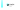

---
<p align="center">

</p>

the24 is a digital clock with alarms, stopwatches and timers.

---

# Dependencies
- Qt 6
  - Qt Core
  - Qt GUI
  - Qt Widgets
  - Qt SVG
  - Qt SQL
  - Qt Multimedia
- [libcontemporary](https://github.com/theCheeseboard/libcontemporary)

# Get
If you're using a supported operating system, we may have binaries available:

| System | Package |
|-------------------|---------------------------------------------------------------------------------------------------------|
| Arch Linux | `the24` on the AUR |

## Build
Run the following commands in your terminal. 
```
cmake -B build -S .
cmake --build build
```

## Install
On Linux, run the following command in your terminal (with superuser permissions)
```
cmake --install build
```

---

> © Victor Tran, 2023. This project is licensed under the GNU General Public License, version 3, or at your option, any later version.
> 
> Check the [LICENSE](LICENSE) file for more information.
